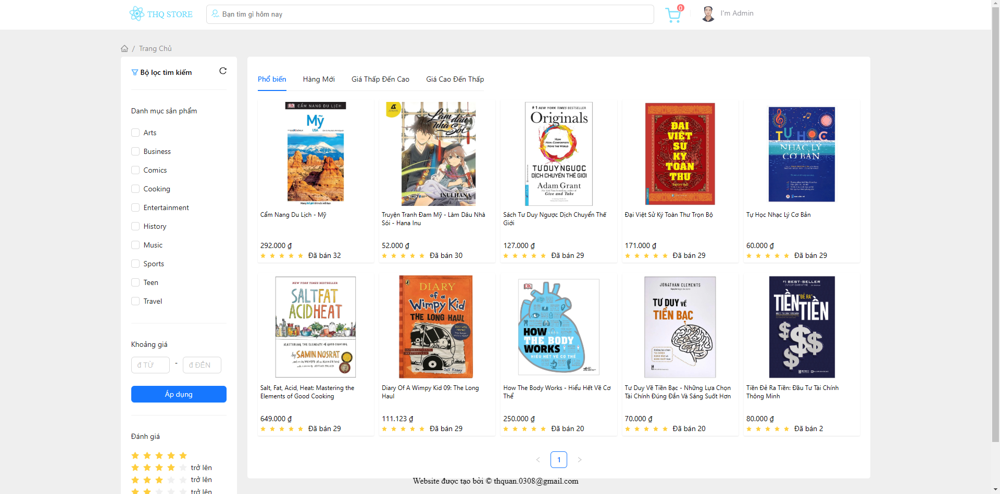
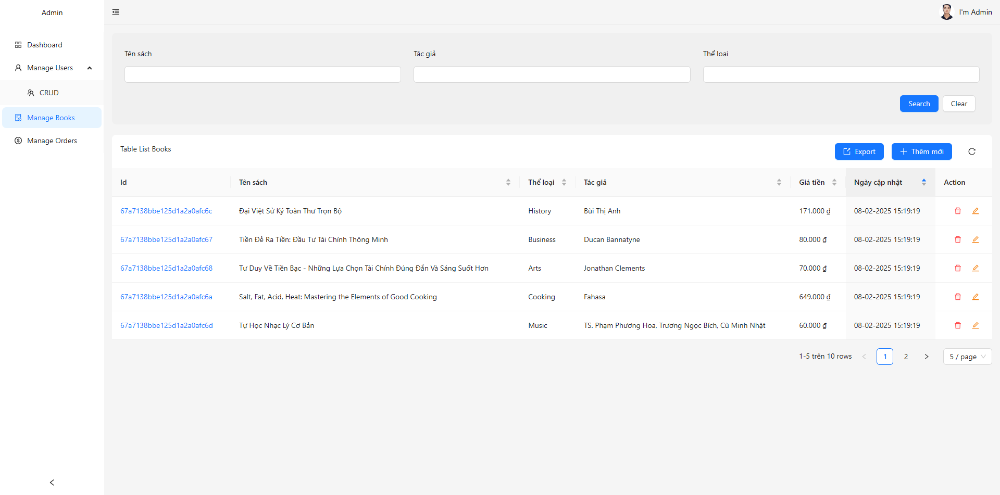

# BOOKSTORE

### Các công nghệ sử dụng:

-   Frontend
    -   Core: React, Vite
    -   Routing: React Router
    -   State: Redux, Redux Persist
    -   UI: Ant Design, Bootstrap
    -   API: Axios
    -   Style: Sass
    -   File: XLSX

### Môi trường cài đặt và công nghệ sử dụng:

Website được xây dựng trên nền tảng ReactJS và NodeJS trong môi trường phần mềm Visual Studio Code. Các công nghệ sử dụng bao gồm:

-   Frontend:

    -   ReactJS: Sử dụng cả React Hooks và React Class Components để xây dựng giao diện người dùng. ReactJS giúp xây dựng các giao diện động và dễ dàng quản lý trạng thái.

    -   Bootstrap: Thư viện giao diện người dùng giúp xây dựng các thành phần đẹp mắt và dễ sử dụng với thiết kế hiện đại.

    -   HTML, CSS, Javascript: CSS được sử dụng để viết mã CSS một cách có cấu trúc và dễ bảo trì, trong khi JavaScript được dùng cho các logic xử lý trên client-side.

-   Backend:

    -   NodeJS: Được sử dụng để xây dựng server-side của ứng dụng, với khả năng xử lý đồng thời rất hiệu quả.

    -   ExpressJS: Framework hỗ trợ việc xây dựng các API RESTful đơn giản và dễ hiểu trên nền tảng NodeJS.

    -   RESTful API: Backend triển khai các API RESTful để frontend và backend giao tiếp với nhau thông qua các HTTP requests (GET, POST, PUT, DELETE).

-   Cơ sở dữ liệu:

    -   MongoDB: Dùng để lưu trữ dữ liệu ứng dụng. MongoDB là cơ sở dữ liệu NoSQL, phù hợp với mô hình dữ liệu linh hoạt và mở rộng.

    -   Mongoose: Là thư viện ODM (Object Data Modeling) được sử dụng để giao tiếp với MongoDB. Mongoose giúp dễ dàng tạo và quản lý các schema và model, giúp thao tác với dữ liệu MongoDB trở nên thuận tiện và an toàn.

    -   Schema: Định nghĩa cấu trúc của các document trong MongoDB.

    -   Model: Các đối tượng tương ứng với các schema trong cơ sở dữ liệu, giúp thực hiện các thao tác CRUD (Create, Read, Update, Delete).

### Về tính năng của hệ thống:

-   Đăng ký và quản lý tài khoản: Người dùng có thể đăng ký, cập nhật thông tin, đổi mật khẩu và khôi phục mật khẩu qua email. Quản trị viên có thể quản lý tài khoản (thêm, sửa, xóa, khóa/mở khóa).

-   Quản lý sách: Quản trị viên có thể thêm, sửa, xóa thông tin sách. Người dùng có thể tìm kiếm sách theo nhiều tiêu chí khác nhau.

-   Quản lý giỏ hàng: Người dùng có thể thêm, xóa, cập nhật số lượng sách trong giỏ hàng.

-   Thanh toán: Hệ thống hỗ trợ phương thức thanh toán khi nhận hàng (COD), giúp khách hàng dễ dàng thanh toán khi nhận sản phẩm.

-   Quản lý đơn hàng: Người dùng có thể xem lịch sử đơn hàng, quản trị viên có thể quản lý và cập nhật trạng thái đơn hàng.

-   Quản lý khuyến mãi: Quản trị viên có thể tạo và quản lý các chương trình khuyến mãi, áp dụng cho các đơn hàng.

-   Phân quyền người dùng: Quản trị viên có toàn quyền quản lý hệ thống, người dùng chỉ xem được thông tin cá nhân và lịch sử đơn hàng.

### Giao diện website

-   Giao diện trang chủ
    

-   Giao diện quản lý của quản trị viên
    

### Link dự án

Link FE: https://github.com/thquan0308/React-Bookstore

Link BE: https://github.com/thquan0308/NodeJS-Bookstore

### Các bước cài đặt:

-   Cài đặt ứng dụng ReactJS: Gõ lệnh

npm install
npm start

-   Các phiên bản sử dụng:

Node version v16.13.1

Npm version 8.1.2
